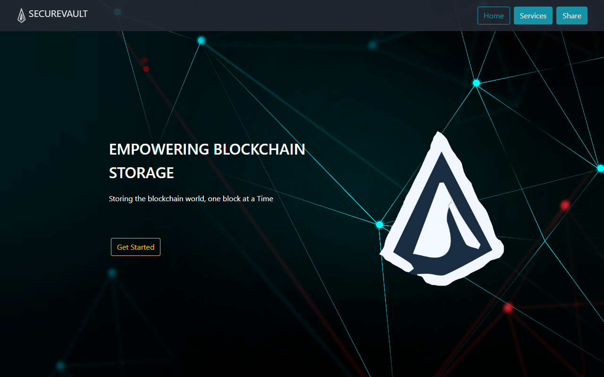

# 🛡 SecureVault — Cloud Security Monitoring Dashboard

A real-time cloud security monitoring dashboard simulating an AWS security operations centre (SOC). Built with vanilla HTML, CSS, and JavaScript — no dependencies, no build tools.



## 🚀 Features

- **Live Threat Feed** — Real-time security event stream with severity classification (Critical / High / Medium / Info)
- **World Threat Map** — Visualises active attack origins across global AWS regions with animated ripple indicators
- **AWS Region Health** — Per-region security and uptime scores for key AWS zones (us-east-1, eu-west-2, ap-southeast-1, etc.)
- **IAM Activity Chart** — 7-day bar chart of successful logins vs. failed authentication attempts
- **Animated KPI Cards** — Live-counting stat cards for critical threats, open vulnerabilities, compliance score, and active sessions
- **Alert Banner System** — Dismissible critical alert notifications
- **Live UTC Clock** — Real-time timestamp in the topbar

## 🧰 Tech Stack

| Layer       | Technology                      |
|-------------|--------------------------------|
| Frontend    | HTML5, CSS3 (custom properties, CSS Grid, animations) |
| Scripting   | Vanilla JavaScript (ES6+)      |
| Charts      | Canvas API (custom bar charts) |
| Fonts       | Space Mono, Syne (Google Fonts)|
| Design      | Terminal/SOC dark UI aesthetic |

## 🔐 Security Concepts Demonstrated

- **IAM (Identity & Access Management)** monitoring and anomaly detection patterns
- **AWS Multi-Region** health visualisation (EC2, S3, IAM regions)
- **Threat classification** — CVSS-style severity tagging (Critical → Info)
- **MFA enforcement** tracking
- **S3 data egress** anomaly detection
- **Brute force / port scan** event logging
- **Compliance scoring** (aligned with SOC 2 / ISO 27001 concepts)

## 📂 Project Structure

```
securevault/
├── index.html          # Main dashboard layout
├── css/
│   └── style.css       # All styles (dark theme, animations, grid)
├── js/
│   └── app.js          # Clock, counter animations, chart, live feed
└── README.md
```

## ⚡ Getting Started

```bash
# Clone the repo
git clone https://github.com/Amrit004/securevault.git

# Open directly in browser (no server needed)
open index.html
```

Or use VS Code Live Server for the best experience.

## 🗺 Roadmap

- [ ] WebSocket integration for real backend event streaming
- [ ] AWS CloudTrail log parser
- [ ] Authentication with JWT
- [ ] Export reports as PDF
- [ ] Dark/light theme toggle
- [ ] D3.js world map with real geolocation data

## 💡 Motivation

This project demonstrates applied knowledge from my MSc Advanced Computer Science coursework at Queen Mary University of London, specifically modules in **Cloud Computing**, **Security & Authentication**, and **Data Analytics**. It simulates the kind of security tooling used in enterprise environments like Bank of America, where I worked as a Deployment/Breakfix Engineer in a secure financial environment.

## 📄 Licence

MIT — free to use, fork, and build upon.

---

Built by **Amritpal Singh Kaur** · [LinkedIn](https://linkedin.com/in/amritpal-singh-kaur-b54b9a1b1) · [GitHub](https://github.com/Amrit004)
